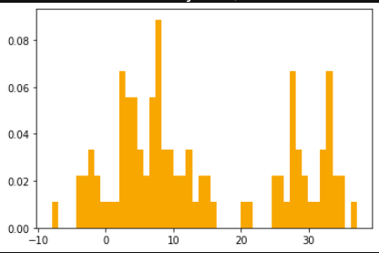
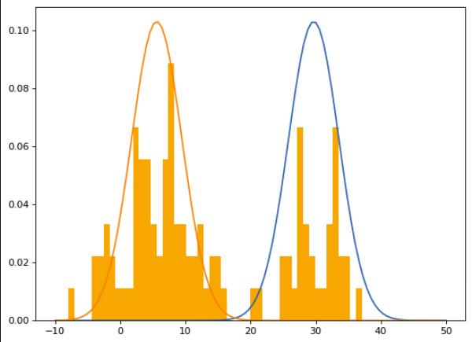

# Expectation-Maximization Algorithm in Python

This is a Python implementation of the EM algorithm for Gaussian Mixture Models from literature. It is not optimized for speed, just practicing an implementation from scratch.

